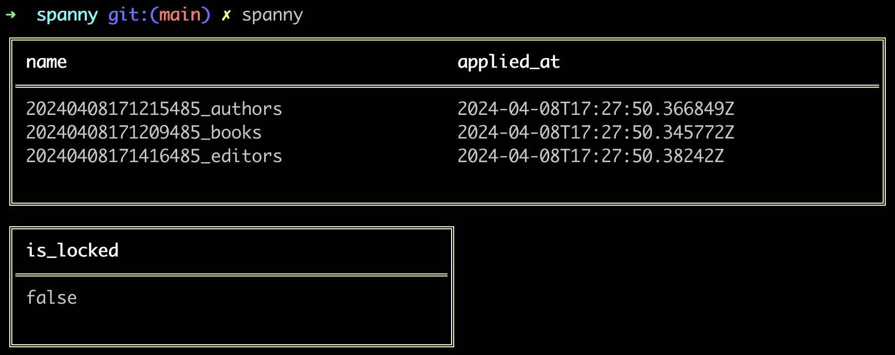

# Spanny

Spanny is a CLI that helps you manage schema migrations with a Spanner Database. It was created to help working locally with the Google Spanner Emulator.

Disclaimer: It's my first project in golang

## Installation

For now there is no tooling for installing Spanny as it is just something for my personal usage. If you want to use it too you must have `golang` installed on you computer. Then you can:
- Clone this repo 
- Run : `$ go build .` at the root of the repository
It will create the `spanny` executable that you can use on your machine as you like.

## Usage

By default `$ spanny` will display the current migration status. It shows the migration currently applied and if the migration table is locked or not.



## Create a DDL migration 

To create a new migration file just type `$ spanny create-ddl my_migration`. This will generate a folder (20240408171209485_DML_my_migration) in the path you've declared in the `.spannyrc` file (migrationFilesPath). This folder will contain a `up.sql` and a `down.sql` file to respectively implement your up and down DDL queries. You'll need to separate each request with a `;`.

## Create a DML migration

It's the same principle as to create a DDL migration. Just type: `$ spanny create-dml my_migration`.


You can see examples in the [migrations folder](https://github.com/SachaCR/spanny/tree/main/migrations) of this repository.

## Spanny help: 

To display the help just type `$ spanny -h`

Here is an overview of the current help display. Prefer using the `$ spanny -h` command as it will be up to date.

```
Usage:
  spanny [flags]
  spanny [command]

Available Commands:
  all             Apply all available migrations
  apply           Apply the next migration
  completion      Generate the autocompletion script for the specified shell
  config          Print Spanny current configuration
  create-db       Create a Spanner database with the given name or default to the config file value
  create-ddl      Create migration files for DDL modification
  create-dml      Create migration files for DML modification
  create-instance Create a Spanner instance with the given name or default to the config file value
  help            Help about any command
  init            Will create the instance, database and utility migration tables
  init-migration  Will create the migration utility table in the database
  list            List migration files
  list-db         List databases
  list-tables     List tables files
  query           Run a read only query against the database
  reset           Rollback all migrations
  rollback        Rollback last migration
  state           Displays the current state of migrations
  update          Run insert or update against the database
  version         Print Spanny version number

Flags:
  -c, --config string   Indicate the configuration path (default "./")
  -e, --env string      Specify spanner environment (default "default")
  -h, --help            help for spanny
  -v, --verbose         Makes spanny more verbose

Use "spanny [command] --help" for more information about a command.
```

## Configuration file

Spanny will by default search for a `.spannyrc.json` file in the current directory. You can specify a path to your config file with the flag `--config` or `-c`.

- `$ spanny -c "./path/to/my/config"`

Configuration Example:
```json
{
    "migrationFilesPath": "./migrations",
    "servicePath": "localhost",
    "port": 9010,
    "envs": {
        "staging": {
            "project": "staging-platform",
            "instance": "staging-instance",
            "database": "staging-database"
        },
        "production": {
            "project": "production-platform",
            "instance": "production-instance",
            "database": "production-database"
        },
        "default": {
            "project": "local-platform",
            "instance": "local-instance",
            "database": "local-database",
            "use-emulator": true
        },
        "test": {
            "project": "test-platform",
            "instance": "test-instance",
            "database": "test-database",
            "use-emulator": true
        }
    }
}
```

## Run the Spanner Emulator

You can follow [this google guide](https://cloud.google.com/spanner/docs/emulator?hl=fr) to run the Spanner emulator locally.

Remember to also export this environment variable: `export SPANNER_EMULATOR_HOST=localhost:9010`

Here are some command to start the container with podman:

- Run the container: `podman run --name spanner-emul -d -e SPANNER_EMULATOR_HOST=localhost:9010 -p 9010:9010 -p 9020:9020 gcr.io/cloud-spanner-emulator/emulator`

- Stop the emulator: `podman stop spanner-emul`
- Restart the emulator: `podman start spanner-emul`

### TODO 

- [ ] Check migrations tables exist in default command.
- [x] Support also inserts and updates in migrations (use `ddl` and `dml` sufffix to separate them).
- [ ] Implement lock migration table during migrations.